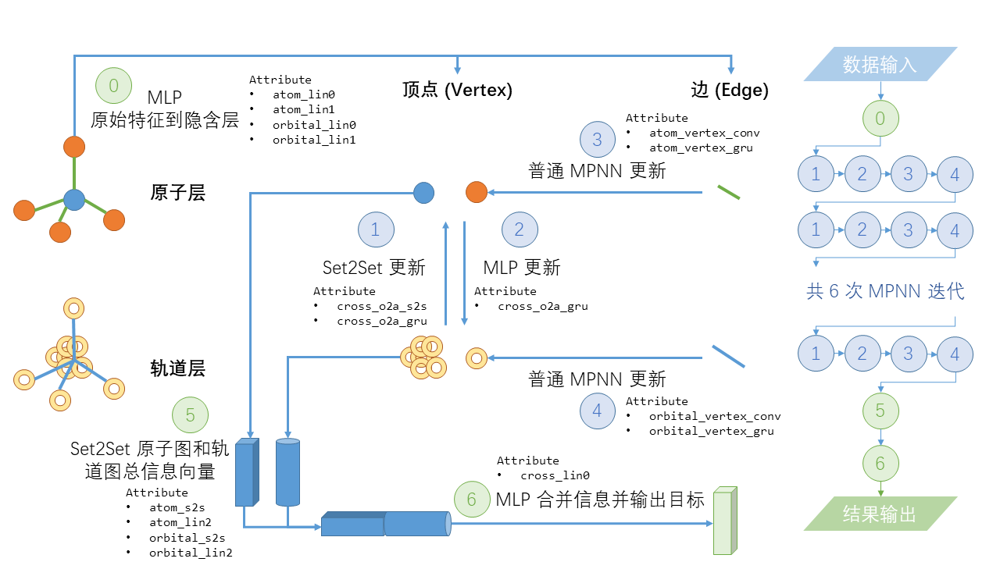

# Alchemy 竞赛程序：双层图神经网络 (Alchemy Competition: Dual-Graph Neural Network, DGNN)

当前目录是我参加 [Alchemy 竞赛](https://alchemy.tencent.com/) 所使用的程序。
但这个程序只是一个 **范例程序**，只使用 Alchemy 数据集的 2% 进行训练与验证。
完整的程序应当不难从范例程序进行更改得到。同时，提交竞赛时所使用的参数可以在 [prog_train_multinet.ipynb](prog_train_multinet.ipynb) 看到。

竞赛名次：23/53

这 **不是** 很好的竞赛结果。事实上，若采用合适的 Early-Stopping 和 k-Fold 策略，并调整一部分参数，竞赛提供的 [baseline 程序](https://github.com/tencent-alchemy/Alchemy/blob/master/pyg/mpnn.py) 相信至少可以达到第 27 名次参赛者的 MAE Loss。

## 此次竞赛所使用 DGNN 模型的简单概述

DGNN 是一个随手捏出来的模型。它合并两个图模型，但两者之间又有所牵绊。

这类模型很有可能早就有人想到了 (譬如 [Zhuang, Ma, WWW 2018](https://dl.acm.org/citation.cfm?id=3186116))，但我的程序里的 DGNN 的灵感除了 MPNN 模型之外真的就没有别的灵感了；跟其他人的文章确实没有什么关系。

其实就是考虑到化学中真正影响分子性质的其实并不是原子，而是电子；但原子同时也对核排斥能和核偶极作贡献，因此也是不可或缺的。
以前文献中，为了描述一个化学问题，通常都假设是原子之间的相互作用，而忽略电子的功效。若从有机或从化学信息学的角度，这可能是合理且充分的；但若从电子结构或量子化学的角度看，这是可能是有问题的。

作为物理化学中电子结构方向的学生，很容易地会想到，我们应该要把原子和电子的贡献都考虑进去。
但一来两者的贡献方式不可能相同；二来原子与电子本身就是非常不同的物理实在，因此也不可能设计出对电子来说与原子相同的特征出来。
既然我们已经假定要使用图神经网络 (Graph Neural Network, GNN)，因此就会想到在同一个模型中设计两个不同的图，让它们在训练时各自更新并又有所偶联。

但另一个问题是，电子在分子中是离域的，很难用特征描述好电子的行为；因而退而求其次，使用轨道的特征来描述电子的行为。
这其实是一个很不好让步。我们本来希望一个 GNN 模型可以既描述好中性分子的行为，也描述好正负离子的行为。但轨道本身是不能体现电子数的改变。
这个模型中唯一让给电子的部分是，将分子的电子云密度初猜矩阵 (通过动能矩阵加核势能矩阵构造初始 Fock 矩阵，对其作对角化并给出轨道系数和密度初猜) 放到轨道层图的边特征中。
这个实在是太不明显了，一方面其它的边特征描述很容易将密度初猜掩盖掉，另一方面边特征描述尽管重要但可能不如顶点特征描述，因此不是什么好的做法。

我不清楚 DGNN 会不会更适合用于社交网络的建模中；但至少因为我自己的原因，这次在化学中的尝试不能算太成功。

这次竞赛所使用的 DGNN 模型的具体表现大致可以通过下述图像理解；其中使用等宽字体写出的 Attribute 可以参考程序 `mpnn_multinet.py`。

## 如何执行程序

由于 PySCF 只能在 Linux 环境下运行，因此这个程序的执行需要在 Linux 环境。

程序尚未在没有 GPU 的环境下调试。

1. 安装预备的 Python 环境，可能至少需要安装
    - python 3.7
    - numpy
    - pyscf
    - rdkit
    - jupyter
    - [pytorch](https://pytorch.org/)，使用 conda 安装
    - [pytorch geometric](https://pytorch-geometric.readthedocs.io/en/latest/notes/installation.html)，使用 pip 安装，需要在有 GPU 的机器或节点上安装
    - conda 和 pip 安装可以借助清华 Tuna 镜像站加速，包括 pytorch，但可能不包括 rdkit。

2. 在联网的情况下，执行 [exec.sh](exec.sh)
    - 在报错或无法联网的情况下，请尝试按顺序分别执行 `step*` 的脚本，或等价地完成脚本所完成的工作。

3. 你能看到输出的 `targets_valid_00.csv`；这相当于一个小的测试集输出数据。
    - 若使用全部的训练、验证与测试集，这份文件可以用于上传到竞赛网站上给出结果。
    - 执行一套过程可能需要花费 10-20 分钟，取决于网络情况、硬盘 I/O 效率、与机器 GPU 效率。

## 目录结构

- 程序
    - [sdf_reader.py](sdf_reader.py)：用于将原始数据集的 .sdf 文件作处理，得到 .dat 文件
    - [alchemy_data.py](alchemy_data.py)：用于合并 .dat 文件的数据，生成可以用于训练的数据集
    - [mpnn_multinet.py](mpnn_multinet.py)：DGNN 模型的框架程序
    - [train_multinet.py](train_multinet.py)：对数据作最后预处理，和实际执行训练的程序
- 脚本
    - [step1_download.sh](step1_download.sh)：下载数据
    - [step2_split.sh](step2_split.sh)：解压数据，通过伪随机种子生成 2% 训练与验证集，并对验证集作 5-Fold 分割
    - [step3_gendat.sh](step3_gendat.sh)：生成 pyg 可以读取的数据集文件，即 .pt 文件
    - [step4_training.sh](step4_training.sh)：执行训练、验证与测试过程
    - [exec.sh](exec.sh)：统一上述四个脚本
    - [generate_cross_valid.py](generate_cross_valid.py)：实际执行生成 2% 训练与验证集和 5-Fold 分割的程序
    - [merge_split.py](merge_split.py)：将 5-Fold 的五次训练结果作 Ensemble，生成 `answer.csv`
- 文档
    - [prog_sdf_reader.ipynb](prog_sdf_reader.ipynb) 或 [docs/prog_sdf_reader.html](docs/prog_sdf_reader.html)：对 [sdf_reader.py](sdf_reader.py) 的补充说明
    - [prog_alchemy_data.ipynb](prog_alchemy_data.ipynb) 或 [docs/prog_alchemy_data.html](docs/prog_alchemy_data.html)：对 [alchemy_data.py](alchemy_data.py) 的补充说明
    - [prog_train_multinet.ipynb](prog_train_multinet.ipynb) 或 [docs/prog_train_multinet.html](docs/prog_train_multinet.html)：对 [train_multinet.py](train_multinet.py) 的补充说明、参数设置说明和其它补充信息
    - [docs/dual_graph_neural_network.png](docs/dual_graph_neural_network.png) 或 [docs/dual_graph_neural_network.pptx](docs/dual_graph_neural_network.pptx)：DGNN 模型的示意与部分补充说明

## 鸣谢

- 感谢导师和组内老师对这份工作的支持，以及组内服务器的支持。
- Alchemy 竞赛也确实推动我进一步理解最近的图神经网络的发展，尽管我悟性确实不高。[Baseline 程序](https://github.com/tencent-alchemy/Alchemy/blob/master/pyg/mpnn.py) (或 pyg 的 [示例程序 qm9_nn_conv](https://github.com/rusty1s/pytorch_geometric/blob/master/examples/qm9_nn_conv.py)) 确实对我的帮助很大。
- [PyTorch Geometric](https://github.com/rusty1s/pytorch_geometric) (在一些程序中) 简单易懂的源代码确实帮助我理解图神经网络从算法上具体实现的过程。
